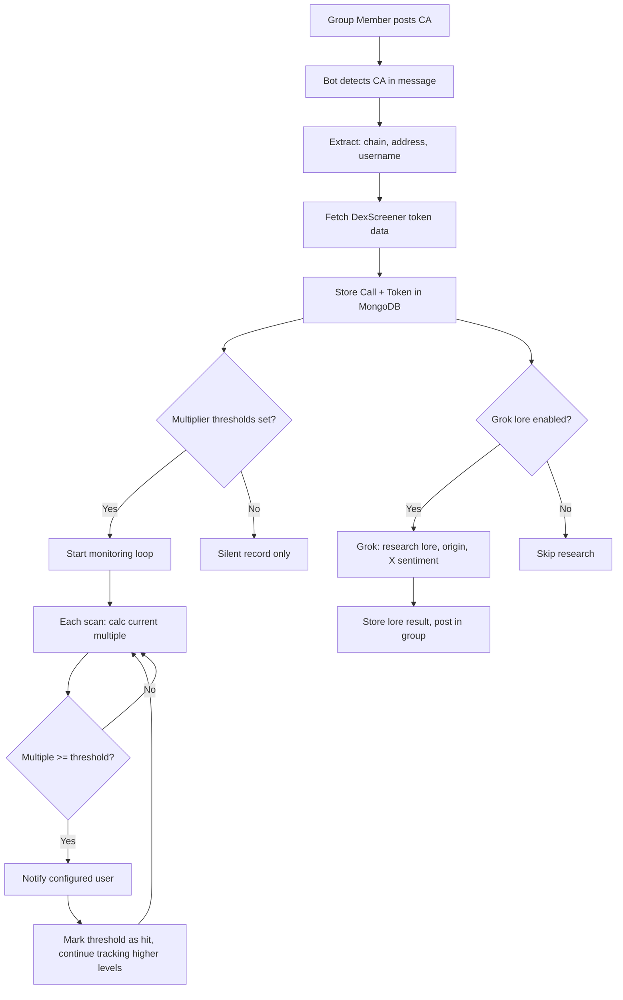

# CallTrack — Product Requirements Document

## Overview

CallTrack is a Telegram **group bot** that detects contract addresses posted by group members, records who called each token, tracks price multiples from the call moment, fires alerts when user-configured multiples are hit, and optionally researches token lore/origin/sentiment via Grok web search on X.

**Core Use Case**: A crypto calls group where members post tokens. The bot passively listens, records every call with caller attribution, and notifies a designated user (e.g., the group admin) when a called token hits a target multiple — enabling tracking of which callers consistently deliver winning calls.

---

## User Stories

| # | Story |
|---|-------|
| 1 | As a group admin, I add the bot to my calls group so it automatically detects any contract address posted |
| 2 | As a group admin, I want to know **who called each token** so I can track caller performance |
| 3 | As a group admin, I set target multiples (e.g., 2x, 5x, 10x) and get notified when a called token reaches them |
| 4 | As a group admin, I want to see a caller leaderboard showing who calls the most winning tokens |
| 5 | As a group admin, I can optionally enable Grok research to get token lore, origin, and X sentiment |
| 6 | As a group admin, I can configure the entry price baseline (call moment price vs. manual entry) |
| 7 | As a group member, I can view my own call history and stats |

---

## Architecture



### Entry Price Determination

| Mode | Behavior |
|------|----------|
| **Call moment** (default) | Entry price = price at the instant the message was posted (fetched immediately on detection) |
| **Manual override** | Admin can set a custom entry price for any token via `/setentry <token> <price>` |

### Multiplier Tracking

Multipliers are **configurable per level** as a global list. Example: `[1.0, 2.0, 5.0, 10.0]`

```
Call price: $0.01
├── 1x ($0.02) → 🔔 Notify
├── 2x ($0.05) → 🔔 Notify
├── 5x ($0.10) → 🔔 Notify
└── 10x ($0.20) → 🔔 Notify
```

Each threshold fires **once only**. Once 2x is hit, it won't fire again unless reset. The token continues tracking toward higher levels.

### Alert Delivery

Alerts are sent as a **private DM** to the configured notification user (not in the group). Each alert includes:

```
🔔 CALL HIT: TOKEN (+200%)
━━━━━━━━━━━━━━━━━━
💰 Entry: $0.01 → Now: $0.03
👤 Caller: @username
🔗 https://dexscreener.com/solana/abc123
📅 Called: 2 hours ago
━━━━━━━━━━━━━━━━━━
Powered by CallTrack
```

---

## Project Structure

```
src/
├── index.js                    # Entry point — connects DB, launches bot
├── bot/
│   └── bot.js                  # Group message listener, commands, callbacks
├── models/
│   ├── Call.js                 # Individual call record (token + caller + timestamp)
│   ├── Caller.js               # Aggregated caller stats (total calls, wins, hit rate)
│   ├── Token.js                # Called token — price, multiples, lore
│   └── Config.js               # Global config (multipliers, notify user, lore toggle)
├── services/
│   ├── dexScreener.js           # DexScreener API client (reused from DexSurgeTracker)
│   ├── callDetector.js          # Contract address detection + chain inference from messages
│   ├── monitor.js               # Multiplier tracking loop
│   ├── grokLore.js              # Grok research: token lore, origin, X sentiment
│   └── notifier.js              # Alert dispatcher (DM to configured user)
```

---

## MongoDB Schemas

### Call

Each individual call of a token by a group member.

```
Call {
  callId:         String (unique)    // {tokenId}:{username}:{timestamp}
  tokenId:        String             // chain:address
  chain:          String             // solana, ethereum, base
  tokenAddress:   String
  tokenName:      String             // from DexScreener
  tokenSymbol:    String             // from DexScreener
  callerUsername: String             // @username of group member
  callerUserId:   String             // Telegram user ID
  groupId:        String             // Telegram group ID
  entryPriceUsd:  Number             // price at call moment
  entryMarketCap: Number             // MC at call moment
  createdAt:      Date               // when the call was posted
}
```

### Caller

Aggregated stats per caller. Updated atomically on each call and each multiplier hit.

```
Caller {
  callerUsername:  String (unique)    // @username
  callerUserId:    String             // Telegram user ID
  totalCalls:      Number             // lifetime call count
  callsAbove1x:    Number             // calls that reached at least 1x
  callsAbove2x:    Number             // calls that reached at least 2x
  callsAbove5x:    Number             // calls that reached at least 5x
  callsAbove10x:   Number             // calls that reached at least 10x
  bestCallTokenId: String             // tokenId of highest multiple call
  bestCallMultiple: Number            // highest multiple achieved
  lastCallAt:      Date
  createdAt:       Date
  updatedAt:       Date
}
```

### Token

Called tokens being actively tracked.

```
Token {
  tokenId:               String (unique)    // chain:address
  chain:                  String
  tokenAddress:           String
  tokenName:              String
  tokenSymbol:            String
  firstCalledBy:          String             // @username of first caller
  firstCalledAt:          Date
  entryPriceUsd:          Number             // call moment price
  entryMarketCap:         Number
  currentPriceUsd:        Number
  currentMarketCap:       Number
  currentMultiple:        Number             // current price / entry price
  peakPriceUsd:           Number
  peakMultiple:           Number
  multiplierLevels:       [Number]           // e.g. [2, 5, 10] (from global config at call time)
  hitLevels:              [Number]           // levels already alerted
  lastNotifiedAt:         Date
  loreEnabled:            Boolean            // per-token lore toggle
  loreResult:             String             // Grok lore research text
  loreResearchedAt:       Date
  isActive:               Boolean            // monitoring paused if false
  createdAt:              Date
  updatedAt:              Date
}
```

### Config

Singleton document — global bot configuration.

```
Config {
  notifyUserId:          String             // Telegram user ID to DM alerts to
  multiplierLevels:      [Number]           // e.g. [1.0, 2.0, 5.0, 10.0]
  loreEnabled:           Boolean            // global lore research toggle
  scanIntervalMs:        Number             // how often to scan prices (default 60s)
  cooldownMs:            Number             // min time between alerts (default 0)
  allowedGroups:         [String]           // Telegram group IDs the bot watches
  createdAt:             Date
  updatedAt:             Date
}
```

---

## Contract Address Detection

The bot listens to all messages in configured groups and detects contract addresses using heuristics:

### Detection Patterns

| Pattern | Example | Chain Inferred |
|---------|---------|---------------|
| DexScreener URL | `https://dexscreener.com/solana/abc123` | Extracted from URL |
| Solana address | `SoL...` (base58, 32-44 chars ending with `pump`) | `solana` |
| Ethereum address | `0x...` (42 chars hex) | `ethereum` (default, user can override) |
| Base address | `0x...` (42 chars hex, with context) | Requires chain selector |

### Chain Ambiguity Resolution

When a bare `0x...` address is detected:
1. First try DexScreener to see which chain returns data
2. If ambiguous, reply in-thread asking the user to confirm chain via inline buttons: `[Ethereum] [Base]`

### Duplicate Handling

If the same `chain:address` pair has already been called:
- **Same caller**: Ignore (duplicate call)
- **Different caller**: Record new Call, update Token's caller count, but do NOT reset entry price

---

## Grok Lore Research

### Research Prompt

When lore is enabled (globally or per-token), the bot uses the xAI Grok API to research:

1. **Token Origin** — Where did this token come from? Who created it? Any known dev/team?
2. **Token Lore** — What's the narrative/story? Meme origin? Cultural context?
3. **X/Twitter Sentiment** — What are people saying? Bullish/bearish consensus?
4. **Red Flags** — Any scam warnings, rug history, or controversy?

```
SYSTEM: "You are a crypto token researcher. Search X/Twitter, crypto news, and token launch platforms to understand this token's origin, narrative, and community sentiment. Be concise and factual."

USER: "Research the token below. Search X/Twitter for mentions by name, $SYMBOL cashtag, and contract address.

TOKEN: {name} (${symbol})
CHAIN: {chain}
CONTRACT: {address}
DESCRIPTION: {description from DexScreener}

Output in this format:

[ORIGIN]: Where/how this token was created. Known dev/team if any.
[LORE]: The narrative, meme, or cultural context behind this token.
[SENTIMENT]: Current X/Twitter sentiment — bullish, bearish, or mixed with key takes.
[RED FLAGS]: Any scam warnings, rugs, or controversy. None if clean.

Be specific. Cite sources when found (handle names, post references)."
```

### Lore Display

Results are posted as a **reply** in the group thread where the CA was posted:

```
🔍 TOKEN LORE: $SYMBOL
━━━━━━━━━━━━━━━━━━
📖 Origin: Launched via pump.fun by anonymous dev. Community-driven meme coin.
📜 Lore: Inspired by the viral "chill guy" meme. Positioned as anti-utility token.
🐦 Sentiment: Mostly bullish — 4.2K X mentions in last 24h. Key accounts bullish.
⚠️ Red Flags: None detected. No prior rugs from deployer address.
━━━━━━━━━━━━━━━━━━
Source: Grok (xAI) | Verify independently
```

---

## Telegram Commands

| Command | Description | Context |
|---------|-------------|---------|
| `/start` | Welcome + setup guide (prompts to set notify user + multipliers) | DM only |
| `/config` | View + edit global config (multipliers, notify user, lore, scan interval) | DM only |
| `/callers` | Leaderboard of top callers by total calls, 2x+ hits, best multiple | DM or group |
| `/calls` | Recent calls list with price multiples | DM or group |
| `/token <symbol or address>` | View specific token detail: entry, current, multiple, caller, lore | DM or group |
| `/mycalls` | View the sender's own call history and stats | DM or group |
| `/setentry <address> <price>` | Override entry price for a token | DM only |
| `/reset <address>` | Reset hit levels so token re-alerts on same multipliers | DM only |
| `/pause <address>` / `/resume <address>` | Pause/resume monitoring a specific token | DM only |

---

## Callback Buttons

### On Call Detection (in group)

When a CA is detected and processed, the bot replies in-thread with:

```
✅ Call Recorded: $SYMBOL by @username
💰 Entry: $0.0102 | MC: $420K
━━━━━━━━━━━━━━━━━━
[🔗 DexScreener] [📊 Token Detail] [🔍 Lore]
```

Button actions:
- `🔗 DexScreener` → Opens DexScreener in browser
- `📊 Token Detail` → Shows full token tracking card (DM or group)
- `🔍 Lore` → Runs Grok lore research on-demand (if not auto-ran)

### On Token Detail View (DM)

```
💎 TOKEN: $SYMBOL
━━━━━━━━━━━━━━━━━━
📛 Name: Token Name
🔗 Chain: Solana
👤 First Called By: @username
📅 Called: 3 hours ago
━━━━━━━━━━━━━━━━━━
💰 Entry: $0.0102 | Now: $0.0306
📊 Multiple: 3.0x
🏔 Peak: 3.5x
━━━━━━━━━━━━━━━━━━
🎯 Target Levels: [1x✅] [2x✅] [5x] [10x]
━━━━━━━━━━━━━━━━━━
[🔗 DexScreener] [📊 Refresh] [🔍 Lore] [⏸ Pause]
```

---

## Config Panel via `/config`

```
⚙️ CallTrack Configuration
━━━━━━━━━━━━━━━━━━
👤 Notify User: @admin_username
🎯 Multipliers: [1x, 2x, 5x, 10x]
🔍 Auto-Lore: ON
⏱ Scan Interval: 60s
━━━━━━━━━━━━━━━━━━
[Edit Notify User] [Edit Multipliers] [Toggle Lore] [Edit Scan]
```

Inline button flows:
- `Edit Notify User` → prompts for Telegram username
- `Edit Multipliers` → prompts for comma-separated numbers e.g. `1,2,5,10`
- `Toggle Lore` → flips global lore on/off
- `Edit Scan` → prompts for seconds (minimum 30s)

---

## Caller Leaderboard via `/callers`

```
🏆 TOP CALLERS
━━━━━━━━━━━━━━━━━━
1. @trader_joe — 47 calls | 12 above 2x | 🏔 8.2x best
2. @alpha_hunter — 32 calls | 8 above 2x | 🏔 5.1x best
3. @meme_king — 28 calls | 5 above 2x | 🏔 3.4x best
━━━━━━━━━━━━━━━━━━
Updated: 2 min ago
```

---

## Monitoring Loop

```
Every scanIntervalMs (default 60s):
  For each active Token:
    1. Fetch current price from DexScreener
    2. Calculate currentMultiple = currentPrice / entryPrice
    3. Update peakPrice / peakMultiple if new high
    4. Check each pending multiplierLevel:
       If currentMultiple >= level AND level NOT in hitLevels:
         - Add level to hitLevels
         - Send alert to notifyUserId (DM)
         - Update Caller stats (increment callsAbove{level}x)
    5. Update Token in DB
```

---

## Tech Stack

| Layer | Technology |
|-------|-----------|
| Runtime | Node.js with Babel |
| Telegram API | Telegraf v4 |
| Database | MongoDB via Mongoose |
| HTTP Client | Axios |
| API Sources | DexScreener, xAI (Grok) |
| AI SDK | OpenAI (compatible with Grok endpoint) |
| Scheduler | Custom guarded `setTimeout` loop |

---

## Environment Variables

```
# Telegram
TELEGRAM_BOT_TOKEN=your_bot_token

# MongoDB
MONGODB_URI=your_mongodb_uri

# Grok (xAI) — for lore research
GROK_API_KEY=your_grok_api_key

# Optional: restrict bot to specific groups
ALLOWED_GROUPS=-1001234567890,-1009876543210
```

---

## Design Rules

### DexScreener Integration
- Uses the **first** object returned from `token-pairs/v1/{chain}/{address}`
- `priceUsd` from `pair.priceUsd`
- `marketCap` from `pair.marketCap`
- 30-second axios timeout on all calls

### Multiplier Calculation
- `currentMultiple = currentPriceUsd / entryPriceUsd`
- Rounded to 2 decimal places
- Alerts fire when `currentMultiple >= targetLevel` for the first time
- Each level fires **once only** per token (tracked in `hitLevels` array)

### Contract Address Detection
- Solana: base58, 32-44 chars, case-sensitive, no `0x` prefix
- Ethereum/Base: `0x` + 40 hex chars (42 total), case-insensitive is valid but stored as-is from DexScreener
- DexScreener URL: regex match `dexscreener.com/{chain}/{address}`
- Minimum address length: 32 characters
- Messages with no address are silently ignored

### Grok Lore Research
- Model: `grok-4-1-fast` (non-reasoning for speed)
- `temperature`: 0.3, `max_tokens`: 1500
- Endpoint: `https://api.x.ai/v1` (OpenAI-compatible)
- Runs immediately on call detection if global `loreEnabled` is true
- Can be re-run on-demand via the `🔍 Lore` button
- Results stored on the Token document and re-displayed until re-run
- 30-second timeout; fails gracefully with a brief error message

### Caller Stats
- Updated atomically on each call and each multiplier hit
- `bestCallMultiple` and `bestCallTokenId` track the caller's all-time best
- Leaderboard sorted by `callsAbove2x` descending, then `totalCalls` descending

### Reliability
- Guarded recursive `setTimeout` scheduler (same pattern as DexSurgeTracker)
- Per-token try/catch — a failing token never stalls the monitor loop
- Silent error handling for Telegram API transient failures
- DexScreener 30s timeout prevents hung requests
- Global unhandled rejection handler

---

## Implementation Phases

### Phase 1: Core Detection & Recording
- Group message listener + contract address detection
- DexScreener data fetch on detection
- Call + Token + Caller schema and persistence
- In-group reply confirming call recorded

### Phase 2: Multiplier Monitoring
- Monitoring loop with configurable scan interval
- Multiplier level configuration via `/config`
- Alert dispatch to configured notify user (DM)
- Caller stat updates on multiplier hits

### Phase 3: Grok Lore Research
- `grokLore.js` service with structured prompt
- Auto-run on call detection (when enabled)
- On-demand re-run via button
- Lore display in group thread

### Phase 4: Commands & UX
- `/callers` leaderboard
- `/calls` recent calls list
- `/token` detail view with inline buttons
- `/mycalls` personal stats
- `/config` full config panel with inline editing
- Call detection reply buttons (DexScreener, Detail, Lore)

---

## Files to Create

| File | Purpose |
|------|---------|
| `src/bot/bot.js` | Group listener, commands, callbacks |
| `src/models/Call.js` | Call record schema |
| `src/models/Caller.js` | Aggregated caller stats schema |
| `src/models/Token.js` | Called token schema |
| `src/models/Config.js` | Global config schema |
| `src/services/dexScreener.js` | DexScreener API client |
| `src/services/callDetector.js` | CA detection + chain inference |
| `src/services/monitor.js` | Multiplier tracking loop |
| `src/services/grokLore.js` | Grok lore research client |
| `src/services/notifier.js` | Alert dispatcher |
| `src/index.js` | Entry point |
| `.env.example` | Environment template |
| `README.md` | Project documentation |
