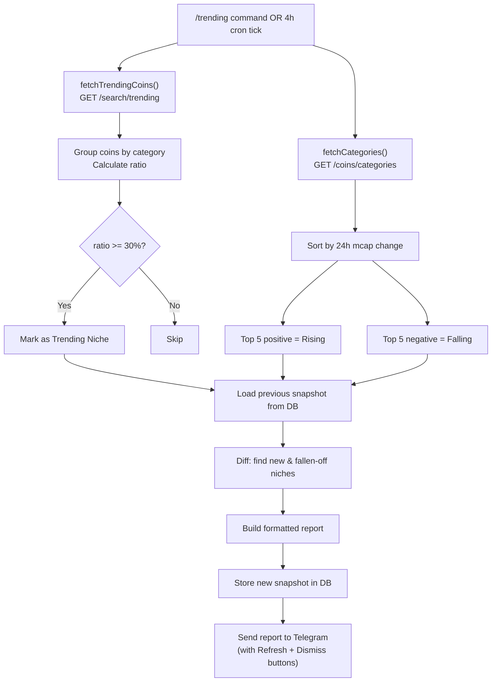

# CoinGecko Trending Discovery — Architecture Plan

## Overview

A standalone "radar" feature that uses CoinGecko's free API to detect which crypto
niches/categories are trending, rising, or falling. Runs automatically every 4 hours
and can be manually triggered via `/trending` in Telegram.

It does **not** cross-reference with monitored tokens — it's a pure discovery tool.

---

## Data Sources

| Endpoint | What it provides | Used for |
|---|---|---|
| `GET /search/trending` | Top trending coins (and their categories) over 24h | Group coins by category → ratio-based trending detection |
| `GET /coins/categories` | All 100+ categories with market cap, volume, 24h % change | Rank top gainers & losers by market cap change |

## Detection Logic

### 1. Trending Niches (from `/search/trending`)

CoinGecko returns trending coins, each tagged with one or more categories. We:

1. Collect all categories across all trending coins
2. Count how many trending coins belong to each category
3. Calculate `ratio = (coins in this category / total trending coins) * 100`
4. If ratio ≥ 30% → **Trending Niche**
5. Store in DB snapshot for historical comparison

### 2. Rising / Falling Categories (from `/coins/categories`)

1. Fetch the full categories list (sorted by `market_cap_change_percentage_24h`)
2. Top 5 positive → **Rising Categories**
3. Top 5 negative → **Falling Categories**
4. Store in DB snapshot

### 3. Snapshot Comparison (historical)

Compare the current snapshot with the **previous** snapshot to detect:

- **New niches** — categories that appear in trending now but weren't in the last snapshot
- **Fallen off niches** — categories that were trending last time but not now
- **New rising/falling entries** — categories entering the top gainers/losers list

---

## Files to Create / Modify

### New Files

#### `src/models/TrendingSnapshot.js`
Mongoose schema storing each analysis run:
```js
{
  fetchedAt: Date,               // when this snapshot was taken
  trendingCategories: [{          // from /search/trending analysis
    name: String,
    coinCount: Number,
    ratio: Number,                // % of trending coins in this category
    coins: [String]               // coin IDs for reference
  }],
  risingCategories: [{            // from /coins/categories top gainers
    name: String,
    marketCap: Number,
    marketCapChange24h: Number
  }],
  fallingCategories: [{           // from /coins/categories top losers
    name: String,
    marketCap: Number,
    marketCapChange24h: Number
  }],
  totalTrendingCoins: Number
}
```

#### `src/services/coinGecko.js`
API client with:
- `fetchTrendingCoins()` — calls `/search/trending`, returns `{ coins: [...] }`
- `fetchCategories()` — calls `/coins/categories?order=market_cap_change_percentage_24h_desc`, returns `[...]`

Both with 30s timeouts and proper error handling (identical pattern to [`dexScreener.js`](src/services/dexScreener.js)).

#### `src/services/trendingMonitor.js`
Core analysis engine with:
- `analyzeTrending(bot)` — main entry point: fetch both endpoints, run detection, compare with previous snapshot, build report, store snapshot, optionally send to Telegram
- `runTrendingCycle(bot)` — wrapper with try/catch for scheduler

### Modified Files

#### `src/services/cron.js`
Add a second guarded `setTimeout` scheduler for trending:
- `setupTrendingCron(bot)` — similar pattern to `setupCron` but with 4h interval
- `updateTrendingInterval(bot, ms)` — runtime config
- Separate `isRunning` / `isStopped` flags (`trendingIsRunning`, `trendingIsStopped`)

#### `src/bot/bot.js`
Add:
- `/trending` command → calls `analyzeTrending(bot)` and sends formatted report
- Register `/trending` in `setMyCommands`
- Add "Trending" button to the `/start` and `/config` menus
- Callback handler for `cfg_trending` if you want interval config

#### `src/index.js`
Wire up at startup (after bot launch):
```js
setupTrendingCron(bot);
```

#### `src/models/Stats.js`
Add optional trending config fields:
```js
trendingIntervalMs: { type: Number, default: 14400000 }, // 4 hours
```

#### `.env.example` / `.env`
Add (optional, CoinGecko free tier works without API key but adding one increases rate limit):
```env
COINGECKO_API_KEY=        # optional
```

---

## Report Format (Telegram Message)

```
🌊 TRENDING NICHES — [timestamp]

Trending Niches (≥30% of trending coins):
🟢 Meme (42%) — 8/19 coins
🟢 Doggone (37%) — 7/19 coins
🟢 Solana Ecosystem (32%) — 6/19 coins

📈 Rising Categories (24h mcap change):
🚀 AI & Big Data — +18.5%
🚀 Real World Assets — +12.3%
🚀 DePIN — +9.7%
🚀 Gaming — +8.1%
🚀 Layer 1 — +6.4%

📉 Falling Categories (24h mcap change):
🔻 Polkadot Ecosystem — -5.2%
🔻 BNB Chain — -4.1%
🔻 NFT — -3.8%

🆕 New on the radar (vs last snapshot):
🆕 SocialFi — 25%

⬇️ Fallen off since last snapshot:
⬇️ Storage — was 31%

Last updated: 4h ago | Next auto-update in ~4h

[ 🔄 Refresh Now ] [ 🗑 Dismiss ]
```

---

## Flow Diagram



---

## Error Handling

1. CoinGecko API rate limit (30 calls/min free tier): the 4h schedule is far below this — the only risk is manual `/trending` spamming. Add a simple 2-minute cooldown on the manual trigger.
2. API timeout: 30s axios timeout (same as DexScreener fix)
3. Empty response: show "No trending data available right now"
4. First-ever run (no previous snapshot): skip the "New/Fallen off" sections, note "First snapshot — comparison will be available next cycle"
