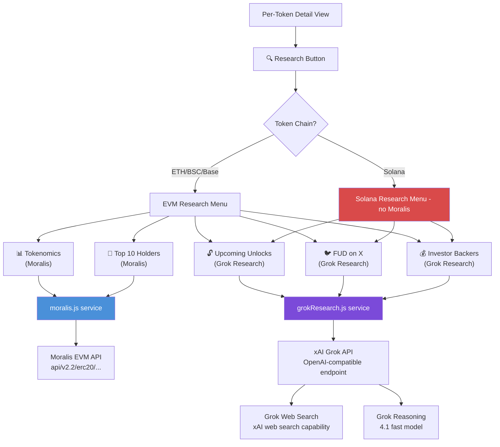
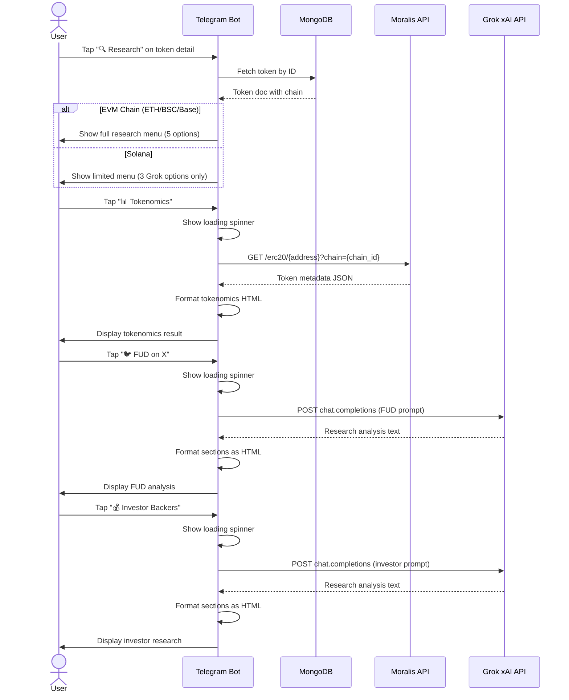

# Implementation Plan: Moralis Tokenomics + Grok Research Features

## Overview

Add 5 new research capabilities to DexSurgeTracker:
1. **Tokenomics Distribution** (Moralis API)
2. **Top 10 Token Holders** (Moralis API)
3. **Upcoming Token Unlocks** (Grok web research)
4. **FUD Check on X** (Grok web research)
5. **Investor & Backer Research** (Grok with template prompt)

All accessible via a new **"🔍 Research" button** on the per-token detail view, plus a standalone **`/research`** command.

---

## Architecture



### New Files

```
src/
├── services/
│   ├── moralis.js              # NEW: Moralis EVM API client
│   └── grokResearch.js         # NEW: Grok research prompts & client
```

### Modified Files

| File | Changes |
|------|---------|
| `.env` | Add `MORALIS_API_KEY=` |
| `src/bot/bot.js` | Add `/research` command, research sub-menu callbacks, research action handlers |
| `README.md` | Document new features, commands, buttons |

---

## Step 1: Environment Configuration

### `.env` — Add Moralis API Key

Add after `GROK_API_KEY`:
```
# Moralis EVM API
MORALIS_API_KEY=your_moralis_api_key_here
```

---

## Step 2: Moralis Service (`src/services/moralis.js`)

### Purpose
Single service file with two exported functions:
- `getTokenMetadata(chain, contractAddress)` — tokenomics (supply, decimals, symbol verification)
- `getTopHolders(chain, contractAddress)` — top 10 wallet holders with balances

### Chain Mapping

```javascript
const CHAIN_ID_MAP = {
  ethereum: '0x1',
  bsc: '0x38',
  base: '0x2105'
};
```

### API Base
- Base URL: `https://deep-index.moralis.io/api/v2.2`
- Auth header: `x-api-key: ${MORALIS_API_KEY}`
- Timeout: 30s (consistent with existing services)

### Endpoint: Token Metadata

```
GET /erc20/{contract_address}?chain={chain_id}
```

Returns: `{ name, symbol, decimals, total_supply_formatted, ... }`

We compute distribution insights:
- Token name & symbol verification
- Total supply
- Whether supply is fully minted
- If `total_supply_formatted` is available, flag very low vs very high supply

### Endpoint: Top Holders

```
GET /erc20/{contract_address}/owners?chain={chain_id}&limit=10&order=DESC
```

Returns: `[{ owner_address, balance_formatted, percentage_relative_to_total_supply, ... }]`

We compute:
- Top holder concentration (% of supply)
- Top 10 combined concentration
- Whale concentration risk flag (>50% held by top 10 = HIGH, >30% = MEDIUM)

### Function Signatures

```typescript
getTokenMetadata(chain: string, address: string): Promise<{
  success: boolean;
  data?: {
    name: string;
    symbol: string;
    decimals: number;
    totalSupply: string;
    tokenType: string;         // e.g. "ERC-20"
  };
  error?: string;
}>

getTopHolders(chain: string, address: string): Promise<{
  success: boolean;
  data?: {
    holders: Array<{
      address: string;
      balance: string;
      percentOfSupply: number;
    }>;
    totalHolders: number;
    top10Concentration: number;  // % held by top 10
    riskLevel: 'LOW' | 'MEDIUM' | 'HIGH';
  };
  error?: string;
}>
```

### Edge Cases
- Solana tokens: both functions return `{ success: false, error: 'Moralis EVM API does not support Solana' }`
- Invalid address: return error from Moralis
- Zero holders: return empty array, risk=HIGH
- Rate limiting: respect Moralis rate limits with 2s inter-request delay

---

## Step 3: Grok Research Service (`src/services/grokResearch.js`)

### Purpose
Reuses the existing Grok API pattern (OpenAI-compatible client via `https://api.x.ai/v1`) but with dedicated research prompts. Uses `grok-4-1-fast` model for quick reasoning.

The service has 3 exported functions, one per research type:

### 3a. `checkFUD(tokenName, tokenSymbol, chain, marketCap, priceUsd)`

**Prompt Design:**
```
You are a crypto sentiment analyst. Research the current social media sentiment for the token below, focusing on X (Twitter), Reddit, and crypto news.

Search for:
1. Negative sentiment / FUD — criticism, scam accusations, rug-pull concerns
2. Recent controversies or team drama
3. Red flags in tokenomics or smart contract
4. Competitor attacks or coordinated FUD campaigns

Token: {symbol} ({name}) on {chain}
Market Cap: ${marketCap}
Price: ${priceUsd}

Output format:
[CONFIDENCE]: LOW / MEDIUM / HIGH
[FUD SUMMARY]: 2-3 sentence summary
[KEY CONCERNS]: bullet points of 3-5 specific concerns found
[OVERALL]: BULLISH / NEUTRAL / BEARISH
```

**Output processing:** Parse sections, format as inline HTML for Telegram.

### 3b. `checkUpcomingUnlocks(tokenName, tokenSymbol, chain)`

**Prompt Design:**
```
You are a crypto tokenomics analyst. Research upcoming token unlock events for the project below.

Search for:
1. Upcoming unlock dates and amounts (team, VC, foundation, community allocations)
2. Seed/private round vesting schedules
3. Any recent or imminent large unlocks
4. Total locked vs circulating supply

Project: {name} ({symbol}) on {chain}

Output format:
[NEXT UNLOCK]: {date} — {amount} tokens (~${value if known})
[UPCOMING]: bulleted list of known unlock events within 90 days
[UNLOCK RISK]: LOW / MEDIUM / HIGH / CRITICAL
[NOTES]: 1-2 sentences on overall unlock health
```

### 3c. `researchInvestors(tokenName, tokenSymbol, chain, marketCap)`

**Prompt Design (template to be refined later):**
```
You are a crypto venture capital analyst. Research the investors and backers of the project below.

Search for:
1. Funding rounds (seed, private, Series A, etc.) — amounts and dates
2. Notable VC funds, angels, and institutional backers
3. Lead investors and their track record
4. Total amount raised and valuation at last round
5. Any relationship to major exchanges or market makers

Project: {name} ({symbol}) on {chain}
Current Market Cap: ${marketCap}

Output format:
[FUNDING]: {total raised} across {N} rounds
[NOTABLE INVESTORS]:
- {Investor 1} — {role/round}
- {Investor 2} — {role/round}
...
[LAST ROUND]: {date} — ${amount} at ${valuation}
[INVESTOR QUALITY]: STRONG / MODERATE / WEAK / UNKNOWN
[NOTES]: 1-2 sentence verdict
```

### Service Implementation Pattern

```javascript
const research = async (prompt) => {
  const client = new OpenAI({ apiKey: GROK_API_KEY, baseURL: 'https://api.x.ai/v1' });
  const response = await client.chat.completions.create({
    model: 'grok-4-1-fast-non-reasoning',
    messages: [
      { role: 'system', content: 'You are a crypto research analyst. Be concise, factual, and focused on actionable data. Use web search when available.' },
      { role: 'user', content: prompt }
    ],
    temperature: 0.3,
    max_tokens: 2000,
    stream: false
  });
  return response.choices[0].message.content;
};
```

**Note:** Grok 4.1 Fast with web search capability can pull real-time data. If web search is not enabled by default on the API, the prompt instructs the model to note "research limited to training data" in the output.

### Key Differences from `grok.js`
- `grok.js` is hard-coupled to `levTemplate.js` (SYSTEM_TEMPLATE + buildUserMessage)
- `grokResearch.js` has its own self-contained prompt system
- Higher `max_tokens` (2000 vs 1500) for richer research output
- Each function embeds its own prompt template inline

---

## Step 4: Bot Integration (`src/bot/bot.js`)

### 4a. New Command: `/research`

Registers in `setMyCommands` array and adds a handler. Flow:

```
/research → show list of monitored tokens (inline buttons)
  → user taps a token → show research sub-menu for that token
```

```
/research {tokenId} → skip token selection, go straight to research sub-menu
```

### 4b. Research Sub-Menu Callback

Callback prefix: `research_menu:{tokenId}`

When triggered, shows an inline keyboard tailored to the token's chain:

**For EVM tokens (ETH/BSC/Base):**
```
🔍 Research: {SYMBOL}
What would you like to research?

[📊 Tokenomics] [👥 Top 10 Holders]
[🔓 Upcoming Unlocks] [🐦 FUD on X]
[💰 Investor Backers]
[⬅️ Back to Detail] [🗑 Dismiss]
```

**For Solana tokens:**
```
🔍 Research: {SYMBOL} (Solana)
⚠️ Tokenomics & holder data unavailable for Solana via Moralis.

[🔓 Upcoming Unlocks] [🐦 FUD on X]
[💰 Investor Backers]
[⬅️ Back to Detail] [🗑 Dismiss]
```

### 4c. New Button in Per-Token Detail View

In the `load_details:` callback handler, add a new row to the inline keyboard:

```javascript
// Add after the Lev Strategy row
[Markup.button.callback('🔍 Research', `research_menu:${token._id}`)]
```

This replaces the last row:
```javascript
[Markup.button.callback('⬅️ Back to List', 'list_page:1'), Markup.button.callback('🔍 Research', `research_menu:${token._id}`), Markup.button.callback('🗑 Dismiss', 'dismiss')]
```

### 4d. Research Action Callbacks (5 new handlers)

| Callback Prefix | Action | API Call |
|-----------------|--------|----------|
| `research:tokenomics:{id}` | Tokenomics Summary | `moralis.getTokenMetadata()` |
| `research:holders:{id}` | Top 10 Holders | `moralis.getTopHolders()` |
| `research:unlocks:{id}` | Upcoming Unlocks | `grokResearch.checkUpcomingUnlocks()` |
| `research:fud:{id}` | FUD on X | `grokResearch.checkFUD()` |
| `research:investors:{id}` | Investor Backers | `grokResearch.researchInvestors()` |

Each handler follows this pattern:
1. `ctx.answerCbQuery('Fetching {research_type}...')`
2. Show loading message: `🔄 Researching {SYMBOL} {research_type}...`
3. Call the appropriate service
4. Delete loading message
5. On success: send formatted result as HTML, quoting the original detail view message
6. On failure: send error message, keep research menu visible for retry

### 4e. Output Formatting

Research results use HTML formatting (consistent with leverage strategy output):

```
<b>📊 TOKENOMICS: {SYMBOL}</b>
<b>━━━━━━━━━━━━━━━━━━</b>
<b>Name:</b> {name}
<b>Total Supply:</b> {totalSupply}
<b>Decimals:</b> {decimals}
...

<b>━━━━━━━━━━━━━━━━━━</b>
<b>Source:</b> Moralis API | Powered by DexSurgeTracker
```

```
<b>👥 TOP HOLDERS: {SYMBOL}</b>
<b>━━━━━━━━━━━━━━━━━━</b>
<b>Total Holders:</b> {count}
<b>Top 10 Concentration:</b> {percent}% — [{RISK_LEVEL} RISK]

1. <code>{address_truncated}</code> — {balance} ({percent}%)
2. <code>{address_truncated}</code> — {balance} ({percent}%)
...
10. <code>{address_truncated}</code> — {balance} ({percent}%)

<b>━━━━━━━━━━━━━━━━━━</b>
...

⚠️ <b>Whale Alert:</b> Top 10 holders control {X}% of supply.
```

```
<b>🔓 UNLOCKS: {SYMBOL}</b>
<b>━━━━━━━━━━━━━━━━━━</b>
{raw grok output, formatted with bold section headers}
<b>━━━━━━━━━━━━━━━━━━</b>
<b>Source:</b> Grok 4.1 Research | Verify independently
```

---

## Step 5: Edge Cases & Error Handling

| Scenario | Handling |
|----------|----------|
| Moralis API key not configured | Show "Moralis API key not set" error, suggest adding to .env |
| Moralis rate limited (429) | Retry once after 3s; if still fails, show "Rate limited, try again in 30s" |
| Solana token + Moralis request | Research menu hides Moralis options entirely |
| Grok API key not configured | Show "Grok API key not set" error |
| Grok returns empty response | Show "No results found. Try again or rephrase." |
| Token not found in Moralis | Show "Token not indexed on Moralis" |
| Research menu opened on deleted token | Show "Token no longer monitored" error |
| User taps same research twice | Allow re-fetch; no caching needed (real-time data) |
| Grok web search returns outdated info | Include disclaimer in output footer |

---

## Step 6: File Change Summary

### New Files (2)

| File | Lines | Purpose |
|------|-------|---------|
| `src/services/moralis.js` | ~120 | Moralis EVM API client — `getTokenMetadata()`, `getTopHolders()` |
| `src/services/grokResearch.js` | ~200 | Grok research prompts + client — `checkFUD()`, `checkUpcomingUnlocks()`, `researchInvestors()` |

### Modified Files (3)

| File | Changes |
|------|---------|
| `.env` | Add `MORALIS_API_KEY=` line |
| `src/bot/bot.js` | ~150 lines added: `/research` command, `research_menu:` callback, 5 research action callbacks, research button in detail view |
| `README.md` | Document 5 new features, update command table, update button table |

---

## Step 7: Mermaid — Full Research Flow



---

## Step 8: README Updates

Add new sections:

### Commands Table (add row)
| `/research` | Research a token: tokenomics, holders, unlocks, FUD, investors |

### Per-Token Detail Buttons (add row)
| `🔍 Research` | Open research sub-menu (tokenomics, holders via Moralis; unlocks, FUD, investors via Grok) |

### New Section: "Token Research Features"
Describe the 5 research capabilities, data sources, and chain limitations.

---

## Step 9: Implementation Order

The work should proceed in this order (each is independently buildable):

1. **`moralis.js` service** — can be built and tested in isolation
2. **`grokResearch.js` service** — can be built and tested in isolation
3. **Bot handlers** — wire everything into `bot.js` (depends on 1+2)
4. **`.env` update** — one-line addition
5. **`README.md`** — documentation update

---

## Assumptions

1. **Moralis API key** — you have or will obtain a Moralis API key (free tier supports 100k calls/month, enough for personal use)
2. **Grok web search** — the Grok 4.1 Fast model has web search capability enabled by default at `api.x.ai/v1`; if not, prompts still work with training data and note the limitation
3. **Investor template prompt** — a base template is designed in this plan; you noted you'll provide a refined template later, so the [`grokResearch.js`](src/services/grokResearch.js:1) function for investors should accept an optional `customPrompt` parameter
4. **Multi-chain** — Moralis EVM API covers ETH, BSC, and Base; Solana tokens will only get Grok-powered research options
5. **No new MongoDB collections needed** — research results are ephemeral (not stored), delivered inline as Telegram messages
