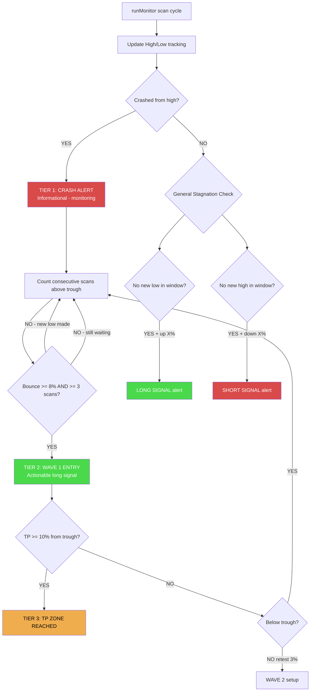
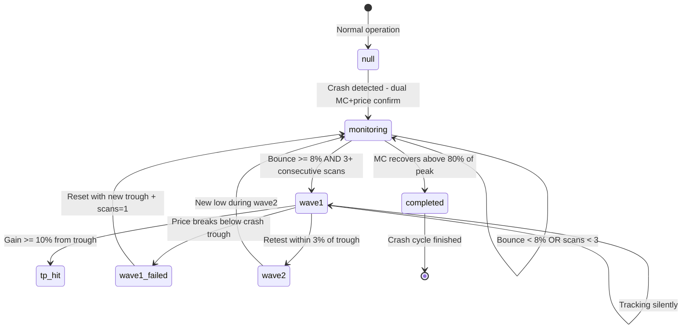
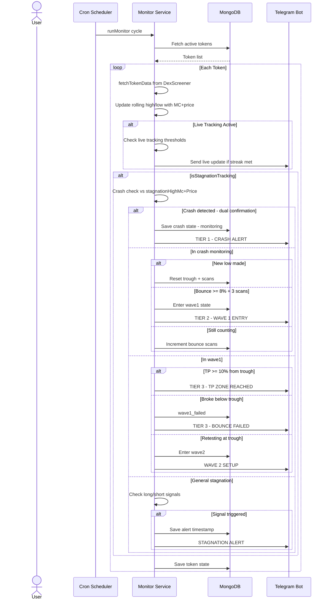

# Implementation Plan: Stagnation & Crash Detection + Dead Cat Bounce Monitoring

## Overview

Add three new monitoring capabilities to DexSurgeTracker:

1. **Stagnation Detection** — Alert when a token hasn't made a new high or low in the last 4-48 hours AND has moved X% from that extreme. Signals exhaustion and potential reversal.
2. **Crash Detection** — Detect tokens that have dumped >40% (configurable 30-80%) within a configurable window (4-48hrs) and auto-switch to dead cat bounce monitoring. Uses rolling high with dual MC+price confirmation.
3. **Dead Cat Bounce Monitoring** — Three-tier alert system: (1) Crash alert — informational, (2) Bounce confirmed — Wave 1 long entry signal, (3) TP hit / failure / retest — trade management.

The bounce confirmation uses **price action, not a clock** — entry fires as soon as a real bounce is detected (≥8% from trough, held for 3 consecutive scans), which could be 5 minutes or 3 hours after the crash.

The same stagnation logic is inverted for uptrending tokens to generate short signals.

---

## Architecture



---

## How It Works (Conceptual)

```
Every scan cycle for each token:

1. Update rolling high/low with MC+price timestamps

2. Check crash detection (dual MC+price confirmation):
   ├── CRASHED → TIER 1: 🚨 CRASH ALERT (informational)
   │              Enter 'monitoring' state
   │              Track bounce confirmation scans
   └── NOT crashed → Skip to general stagnation check (step 5)

3. If in 'monitoring' state — count bounce confirmation:
   ├── New low made → Reset trough, restart scan counter
   ├── Price above trough + ≥8% bounce AND ≥3 consecutive scans
   │   └── TIER 2: 🐱 WAVE 1 ENTRY (actionable long signal)
   │       Entry reference = crash trough
   │       TP target = trough × 1.20
   └── Otherwise → Keep counting

4. If in 'wave1' state — manage the trade:
   ├── TP hit (≥10% from trough) → TIER 3: 🎯 TP ZONE REACHED
   ├── Breaks below trough → 💀 FAILED → back to monitoring with new trough
   ├── Retests within 3% of trough → Wave 2 setup
   └── Still in progress → track silently

5. General stagnation (non-crash tokens):
   ├── No new low in window + up X% from low → LONG signal
   └── No new high in window + down X% from high → SHORT signal
```

---

## Three-Tier Alert System

| Tier | Name | Trigger | Nature | Example (Beat Token) |
|------|------|---------|--------|---------------------|
| **1** | Crash Alert | Dual MC+price crash confirmed | **Informational** — heads up | T+8hrs at 6.2315: "Crashed -45%. Monitoring for bounce..." |
| **2** | Wave 1 Entry | Bounce ≥8% from trough + 3 consecutive scans holding | **Actionable** — long entry signal | T+8:12 at 7.05: "Bounce confirmed +13%. Entry at 6.23. TP: 7.48." |
| **3** | TP Hit / Failed | TP reached (≥10% from trough) OR breaks below trough | **Management** — exit or adjust | T+10hrs at 8.5: "TP zone reached +36%." / T+13hrs at 5.8: "Failed — new low." |

---

## File Changes

| File | Changes |
|------|---------|
| [`src/models/Token.js`](src/models/Token.js:1) | Add 19 new fields for stagnation/crash tracking with MC+price dual metrics + bounce confirmation counter |
| [`src/models/Stats.js`](src/models/Stats.js:1) | Add 8 new global config fields |
| [`src/services/monitor.js`](src/services/monitor.js:1) | Add stagnation, crash detection, bounce confirmation, and dead cat bounce logic (~200 lines) |
| [`src/bot/bot.js`](src/bot/bot.js:1) | Add config buttons, per-token toggle, detail view fields (~80 lines) |
| [`README.md`](README.md:1) | Document new features |

**No new files required.** All logic fits within the existing `monitor.js` service and models. No external API calls needed.

---

## Step 1: Token Model Changes (`src/models/Token.js`)

Add these fields after the existing `lastReportedType` field (line 29):

```javascript
// --- Stagnation & Crash Detection ---

// Rolling high tracking (MC + price captured together at the extreme)
stagnationHighMc: { type: Number, default: 0 },
stagnationHighPrice: { type: Number, default: 0 },
stagnationHighTime: { type: Date, default: null },

// Rolling low tracking (MC + price captured together at the extreme)
stagnationLowMc: { type: Number, default: 0 },
stagnationLowPrice: { type: Number, default: 0 },
stagnationLowTime: { type: Date, default: null },

// Crash detection state machine
crashState: {
  type: String,
  enum: [null, 'monitoring', 'wave1', 'wave1_failed', 'wave2', 'completed'],
  default: null
},
crashPeakMc: { type: Number, default: 0 },         // MC at crash peak
crashPeakPrice: { type: Number, default: 0 },       // Price at crash peak (dual confirmation)
crashTroughMc: { type: Number, default: 0 },       // Lowest MC — THIS IS THE ENTRY REFERENCE
crashTroughPrice: { type: Number, default: 0 },     // Price at trough
crashDetectedAt: { type: Date, default: null },     // When crash was detected

// Bounce confirmation tracking (price-action based, not clock-based)
bounceConfirmationScans: { type: Number, default: 0 }, // Consecutive scans above trough with bounce

// Dead cat bounce wave tracking
deadCatWave1EntryMc: { type: Number, default: 0 },     // = crashTroughMc (entry reference)
deadCatWave1EntryPrice: { type: Number, default: 0 },  // = crashTroughPrice
deadCatWave1TargetMc: { type: Number, default: 0 },    // TP target in MC
deadCatWave1TargetPrice: { type: Number, default: 0 }, // TP target in price
deadCatWave1TpHit: { type: Boolean, default: false },

// General stagnation alert cooldown
stagnationAlertedAt: { type: Date, default: null },
stagnationLastType: { type: String, enum: ['long', 'short', null], default: null },

// Per-token stagnation toggle
isStagnationTracking: { type: Boolean, default: false }
```

---

## Step 2: Stats Model Changes (`src/models/Stats.js`)

Add these fields after the `sentimentWindowHours` field (line 12):

```javascript
// Stagnation & Crash Detection defaults
stagnationWindowMs: { type: Number, default: 14400000 },      // 4 hours (configurable 1-48 hrs)
stagnationPercent: { type: Number, default: 5 },              // 5% move from extreme
stagnationCooldownMs: { type: Number, default: 3600000 },     // 1 hour between alerts

// Crash detection
crashPercentThreshold: { type: Number, default: 40 },         // 40% drop = crash (configurable 30-80%)
crashWindowMs: { type: Number, default: 86400000 },           // 24 hours crash window (configurable 4-48 hrs)

// Bounce confirmation (price-action based entry trigger)
bounceConfirmPercent: { type: Number, default: 8 },           // 8% bounce from trough to confirm
bounceConfirmMinScans: { type: Number, default: 3 },          // 3 consecutive scans above trough

// Dead cat bounce master toggle
deadCatBounceEnabled: { type: Boolean, default: true }
```

---

## Step 3: Monitor Logic (`src/services/monitor.js`)

### 3a. New Constants (top of file)

```javascript
// Dead cat bounce wave TP targets
const WAVE1_TP_MIN = 10;   // 10% minimum TP from trough
const WAVE1_TP_MAX = 30;   // 30% maximum TP (beyond this = overshoot warning)
const WAVE1_TP_DEFAULT = 20; // Default TP suggestion (20%)
```

### 3b. Insert After Live Tracking Block

Add a new section `// --- STAGNATION & CRASH DETECTION ---` that runs after the live tracking block (line 211) but before the standard surge alert evaluation:

1. **Update rolling high/low** — capture both MC and price at each extreme
2. **Crash detection** — dual MC+price confirmation from rolling high
3. **Bounce confirmation** — count consecutive scans above trough; fire Wave 1 entry when both % bounce and scan count thresholds are met
4. **Wave 1 management** — track TP, failure, retest
5. **General stagnation** — long/short signals for non-crash tokens

### 3c. High/Low Tracking

Every scan updates rolling extremes with both MC and price from DexScreener:

```
// Update rolling HIGH
If currentMC > stagnationHighMc:
  stagnationHighMc = currentMC
  stagnationHighPrice = data.priceUsd
  stagnationHighTime = now

// Update rolling LOW
If stagnationLowMc === 0 OR currentMC < stagnationLowMc:
  stagnationLowMc = currentMC
  stagnationLowPrice = data.priceUsd
  stagnationLowTime = now
```

Price and MC at each extreme represent the same moment in time — internally consistent snapshots.

### 3d. Crash Detection — Dual Confirmation (MC + Price)

```
highAge = now - stagnationHighTime

If highAge <= crashWindowMs AND stagnationHighMc > 0 AND stagnationHighPrice > 0:

  mcDropPct = (currentMC - stagnationHighMc) / stagnationHighMc * 100
  priceDropPct = (data.priceUsd - stagnationHighPrice) / stagnationHighPrice * 100

  mcCrashed = mcDropPct <= -crashPercentThreshold
  priceCrashed = priceDropPct <= -crashPercentThreshold

  If mcCrashed AND priceCrashed:
    → crashState = 'monitoring'
    → crashPeakMc = stagnationHighMc, crashPeakPrice = stagnationHighPrice
    → crashTroughMc = currentMC, crashTroughPrice = data.priceUsd
    → crashDetectedAt = now
    → bounceConfirmationScans = 1  // first scan above current trough
    → Send TIER 1: 🚨 CRASH ALERT (informational)
```

**Dual confirmation filters supply-change false positives.** A token burn drops MC but not price — real crashes move both metrics together.

### 3e. Bounce Confirmation — The Wave 1 Entry Trigger

This replaces the old 4-hour clock with price-action-based confirmation. Entry fires as soon as the bounce is "real" regardless of how much time has passed.

```
If crashState === 'monitoring':

  // Auto-recovery: MC recovers above 80% of crash peak
  If currentMC >= crashPeakMc * 0.80:
    crashState = 'completed'
    bounceConfirmationScans = 0
    → Send "Crash recovered above 80% of peak — monitoring cleared"

  // New low made — reset everything
  If currentMC < crashTroughMc:
    crashTroughMc = currentMC
    crashTroughPrice = data.priceUsd
    crashDetectedAt = now
    bounceConfirmationScans = 1   // reset counter to 1 (this scan is above the new trough)
    // No alert — new entry zone forming, keep watching

  // Price above trough — count consecutive scans
  If currentMC >= crashTroughMc:
    bouncePct = (currentMC - crashTroughMc) / crashTroughMc * 100

    If bouncePct >= bounceConfirmPercent:
      bounceConfirmationScans++   // increment: this scan qualifies
    Else:
      bounceConfirmationScans = 1 // reset: bounce dipped below confirmation threshold

    // CHECK: bounce ≥ threshold AND enough consecutive scans?
    If bouncePct >= bounceConfirmPercent AND bounceConfirmationScans >= bounceConfirmMinScans:
      // BOUNCE CONFIRMED — FIRE WAVE 1 ENTRY
      crashState = 'wave1'

      // Entry reference is ALWAYS the crash trough (not current price)
      deadCatWave1EntryMc = crashTroughMc
      deadCatWave1EntryPrice = crashTroughPrice
      deadCatWave1TargetMc = crashTroughMc * (1 + WAVE1_TP_DEFAULT / 100)
      deadCatWave1TargetPrice = crashTroughPrice * (1 + WAVE1_TP_DEFAULT / 100)

      // Determine if TP already hit during the confirmation period
      If bouncePct >= WAVE1_TP_MIN:
        deadCatWave1TpHit = true

      → Send TIER 2: 🐱 WAVE 1 ENTRY ALERT
```

### 3f. Wave 1 Management — TP, Failure, Retest

```
If crashState === 'wave1':

  gain = (currentMC - deadCatWave1EntryMc) / deadCatWave1EntryMc * 100

  // TP HIT: gain ≥ 10% from trough
  If gain >= WAVE1_TP_MIN AND !deadCatWave1TpHit:
    deadCatWave1TpHit = true
    → Send TIER 3: 🎯 TP ZONE REACHED ALERT

  // FAILED BOUNCE: broke below the original crash trough
  If currentMC < crashTroughMc:
    crashState = 'wave1_failed'
    crashTroughMc = currentMC          // new lower trough = new entry zone
    crashTroughPrice = data.priceUsd
    crashDetectedAt = now
    bounceConfirmationScans = 1        // reset counter
    deadCatWave1TpHit = false
    → Send TIER 3: 💀 BOUNCE FAILED — NEW ENTRY ZONE ALERT

  // Legitimate retest: within 3% above crash trough (not below)
  If currentMC <= crashTroughMc * 1.03 AND currentMC >= crashTroughMc:
    crashState = 'wave2'
    → Send "Retesting crash low — Wave 2 setup. If holds, potential second bounce"

If crashState === 'wave1_failed':
  crashState = 'monitoring'   // back to monitoring with new lower trough
  // crashTroughMc, crashTroughPrice, crashDetectedAt, bounceConfirmationScans already set

If crashState === 'wave2':
  If currentMC < crashTroughMc:
    crashState = 'monitoring'
    crashTroughMc = currentMC
    crashTroughPrice = data.priceUsd
    crashDetectedAt = now
    bounceConfirmationScans = 1
```

### 3g. General Stagnation Logic

```
If crashState === null AND isStagnationTracking === true:
  cooldownOK = !stagnationAlertedAt OR (now - stagnationAlertedAt) > stagnationCooldownMs

  If cooldownOK:
    // LONG SIGNAL: no new low in stagnation window
    timeSinceLow = now - stagnationLowTime
    If timeSinceLow >= stagnationWindowMs:
      pctFromLow = (currentMC - stagnationLowMc) / stagnationLowMc * 100
      If pctFromLow >= stagnationPercent:
        stagnationAlertedAt = now
        stagnationLastType = 'long'
        → Send LONG STAGNATION ALERT

    // SHORT SIGNAL: no new high in stagnation window
    timeSinceHigh = now - stagnationHighTime
    If timeSinceHigh >= stagnationWindowMs:
      pctFromHigh = (currentMC - stagnationHighMc) / stagnationHighMc * 100
      If pctFromHigh <= -stagnationPercent:
        stagnationAlertedAt = now
        stagnationLastType = 'short'
        → Send SHORT STAGNATION ALERT
```

---

## Step 4: Alert Message Formats

### Tier 1 — Crash Alert (Informational)

```
🚨 CRASH DETECTED: {SYMBOL} 🚨
━━━━━━━━━━━━━━━━━━
📉 MC: -{mcDropPct}% | Price: -{priceDropPct}%
🏔 Peak: ${peakMc} MC at ${peakPrice}
📉 Trough: ${troughMc} MC at ${troughPrice}
━━━━━━━━━━━━━━━━━━
🔍 Monitoring for dead cat bounce...
✅ Entry triggers when: bounce ≥{bounceConfirmPercent}% and holds for {bounceConfirmMinScans} consecutive scans
🎯 Wave 1 TP target: +{WAVE1_TP_DEFAULT}% from trough = ${targetMc}
```

### Tier 2 — Wave 1 Entry (Actionable)

Standard case (bounce ongoing, below TP):
```
🐱 WAVE 1 ENTRY: {SYMBOL} 🐱
━━━━━━━━━━━━━━━━━━
✅ Bounce confirmed: +{bouncePct}% from trough
📉 Crash Trough: ${troughMc} MC at ${troughPrice}
💰 Entry Zone: ${entryMc} (entry reference = crash trough)
🎯 TP Target: ${tpMc} (+{WAVE1_TP_DEFAULT}%)
━━━━━━━━━━━━━━━━━━
📊 Bounce held for {scans} consecutive scans
⚡ Remaining upside to TP: +{remainingPct}%
```

Bounce already past TP case:
```
🐱 WAVE 1 ENTRY: {SYMBOL} 🐱
━━━━━━━━━━━━━━━━━━
✅ Bounce confirmed: +{bouncePct}% from trough
📉 Crash Trough: ${troughMc}
🎯 TP target: ${tpMc} — REACHED (+{WAVE1_TP_DEFAULT}%)
━━━━━━━━━━━━━━━━━━
⚠️ Bounce already extended past TP zone
📊 Watch for retest of ${troughMc} for Wave 2 entry
```

### Tier 3 — TP Zone Reached

```
🎯 TP ZONE REACHED: {SYMBOL} 🎯
━━━━━━━━━━━━━━━━━━
📈 Gain: +{gainPct}% from trough ${troughMc}
💰 Entry: ${entryMc} → Current: ${currentMc}
🎯 TP target ${tpMc} reached
━━━━━━━━━━━━━━━━━━
📊 Manage position — consider partial TP
📉 Watch for retest of ${troughMc} for Wave 2 entry
```

### Tier 3 — Bounce Failed

```
💀 DEAD CAT BOUNCE FAILED: {SYMBOL} 💀
━━━━━━━━━━━━━━━━━━
⚠️ Price broke below crash trough
📉 Old Trough: ${oldTroughMc} MC at ${oldTroughPrice}
📉 New Trough: ${newTroughMc} MC at ${newTroughPrice}
━━━━━━━━━━━━━━━━━━
🔄 New entry zone at ${newTroughMc}
🔍 Monitoring for new bounce confirmation...
✅ Entry triggers: bounce ≥{bounceConfirmPercent}% + {bounceConfirmMinScans} scans
```

### General Stagnation Signals

```
📈 STAGNATION LONG SIGNAL: {SYMBOL}
━━━━━━━━━━━━━━━━━━
⏰ {hours}hrs since last low
📉 Last Low: ${lastLowMc} MC at ${lastLowPrice} ({timeAgo})
📊 Now: ${currentMC} MC (+{pctMC}% MC / +{pctPrice}% price)
━━━━━━━━━━━━━━━━━━
💡 Price stabilizing above recent low — potential reversal

📉 STAGNATION SHORT SIGNAL: {SYMBOL}
━━━━━━━━━━━━━━━━━━
⏰ {hours}hrs since last high
📈 Last High: ${lastHighMc} MC at ${lastHighPrice} ({timeAgo})
📊 Now: ${currentMC} MC ({pctMC}% MC / {pctPrice}% price)
━━━━━━━━━━━━━━━━━━
💡 Price fading from recent high — potential short opportunity
```

---

## Step 5: Example Walkthrough — Beat Token (11.4153 → 6.2315 → 9.4691 → 5.8)

With 40% crash threshold, 8% bounce confirmation, 3 consecutive scans, and dual MC+price confirmation:

| Time | MC | Action |
|------|-----|--------|
| T0 | **11.4153** | `stagnationHighMc = 11.4153`, `stagnationHighPrice = $0.0114`, `stagnationHighTime = T0` |
| T+2hrs | 9.0 | New low. `stagnationLowMc = 9.0` |
| T+4hrs | 7.5 | New low. `stagnationLowMc = 7.5` |
| T+6hrs | 6.8 | New low. `stagnationLowMc = 6.8` |
| T+8hrs | **6.2315** | **TIER 1: 🚨 CRASH ALERT.** Dual confirmation: MC -45.4%, price also down ≥40%. `crashState='monitoring'`, `crashTroughMc=6.2315`, `crashTroughPrice=$0.0062`, `bounceConfirmationScans=1`. "Crashed -45%. Monitoring for bounce. Entry triggers at ≥8% + 3 scans." |
| T+8:10 | 6.85 | Bounce +10% (≥8%). Scan 1 qualifying. `bounceConfirmationScans=2`. |
| T+8:11 | 6.92 | Bounce +11% (≥8%). Scan 2 qualifying. `bounceConfirmationScans=3`. **3 scans confirmed!** |
| | | **TIER 2: 🐱 WAVE 1 ENTRY.** `crashState='wave1'`. Entry reference = trough 6.2315. TP = 7.48 (+20%). "Bounce confirmed +11%. Entry at 6.23. TP at 7.48." |
| T+9hrs | 7.2 | +15.5% from entry. Still below TP. Track silently. |
| T+10hrs | 8.5 | +36.4%. Past TP (≥10%). `deadCatWave1TpHit=true`. **TIER 3: 🎯 TP ZONE REACHED.** "Gain +36%. Manage position. Watch for retest for Wave 2." |
| T+12hrs | 9.4691 | +52%. Already past TP — no duplicate alert needed. |
| T+13hrs | **5.8000** | **💀 Below trough 6.2315.** `crashState='wave1_failed'`, new trough=5.8. **TIER 3: "Bounce failed. New entry zone at 5.8."** |
| T+13+1scan | 5.8 | `wave1_failed` → `crashState='monitoring'`. `bounceConfirmationScans=1`. Monitoring for new bounce from 5.8. |

**User experience:**
- Crash alert at 6.2315 — heads up, bounce watch active
- **~2 minutes later:** Wave 1 entry confirmed at +11% — user can enter near 6.23-6.92
- ~2 hours later: TP hit at 8.5 (+36%)
- Exit or partial TP before the drop to 5.8

---

## Step 6: Additional Scenarios

### Scenario A: Fake Bounce Kills Confirmation

| Time | MC | `bounceConfirmationScans` |
|------|-----|---------------------------|
| T | 5.0 | crash: trough=5.0, scans=1 |
| T+1 | 5.5 (+10%) | scans=2 (qualifying) |
| T+2 | 5.6 (+12%) | scans=3 → **WOULD fire... but:** |
| T+3 | 4.8 (-4%) | **NEW LOW.** trough=4.8, scans=1 (reset) |

The bounce confirmation is only 2 scans then a new low resets it. No false entry.

### Scenario B: Slow Bleed Then Bounce

| Time | MC | Action |
|------|-----|--------|
| T | 5.0 | Tier 1: Crash. trough=5.0. |
| T+1hr | 5.1 (+2%) | <8%. `scans=0` (not qualifying). |
| T+2hrs | 5.3 (+6%) | <8%. `scans=0`. |
| T+3hrs | 5.45 (+9%) | ≥8%. `scans=1` (qualifying). |
| T+3:02 | 5.5 (+10%) | ≥8%. `scans=2`. |
| T+3:04 | 5.52 (+10.4%) | ≥8%. `scans=3`. **TIER 2: WAVE 1 ENTRY.** |

Entry fires at +10% bounce after ~3hrs. Entry reference = 5.0, TP = 6.0.

### Scenario C: Ultra-Fast V-Bounce (Past TP at Confirmation)

| Time | MC | Action |
|------|-----|--------|
| T | 3.0 | Tier 1: Crash. trough=3.0. |
| T+0:01 | 3.5 (+17%) | ≥8%. `scans=1`. |
| T+0:02 | 3.8 (+27%) | ≥8%. `scans=2`. Also ≥TP zone already. |
| T+0:03 | 4.2 (+40%) | ≥8%. `scans=3`. **TIER 2: WAVE 1 ENTRY.** But bounce already +40% — past TP. Alert says: "Bounce confirmed but +40% — TP zone already hit. Watch for retest." |

Entry still fires — user is informed. Past-TP warning prevents chasing.

---

## Step 7: Bot Integration (`src/bot/bot.js`)

### 7a. `/config` Panel — New Buttons

```javascript
// New rows in /config keyboard:
[Markup.button.callback('📊 Stag. Win', 'cfg_stag_win'),
 Markup.button.callback('📈 Stag. %', 'cfg_stag_pct'),
 Markup.button.callback('⏰ Stag. CD', 'cfg_stag_cd')],
[Markup.button.callback('📉 Crash %', 'cfg_crash_pct'),
 Markup.button.callback('🕐 Crash Win', 'cfg_crash_win')],
[Markup.button.callback('📈 Bounce %', 'cfg_bounce_pct'),
 Markup.button.callback('🔢 Bounce Scans', 'cfg_bounce_scans'),
 Markup.button.callback('🐱 DCB Toggle', 'cfg_dcb_toggle')]
```

Config display lines:
```
📊 Stagnation Window: {stagnationWindowMs/3600000}h
📈 Stagnation %: {stagnationPercent}%
⏰ Stagnation Cooldown: {stagnationCooldownMs/3600000}h
📉 Crash Threshold: -{crashPercentThreshold}%
🕐 Crash Window: {crashWindowMs/3600000}h
📈 Bounce Confirm: ≥{bounceConfirmPercent}%
🔢 Bounce Scans: {bounceConfirmMinScans} consecutive
🐱 Dead Cat Bounce: {deadCatBounceEnabled ? 'ON' : 'OFF'}
```

### 7b. Per-Token Detail View

After live tracking stats:
```javascript
(token.isStagnationTracking ?
  `📊 Stagnation: *TRACKING ✅*\n` +
  `📉 Last Low: $${(token.stagnationLowMc || 0).toLocaleString()} MC | $${token.stagnationLowPrice || 0} price\n` +
  `📈 Last High: $${(token.stagnationHighMc || 0).toLocaleString()} MC | $${token.stagnationHighPrice || 0} price\n` +
  (token.crashState ? `🐱 Crash: *${token.crashState.toUpperCase()}* | Bounce scans: ${token.bounceConfirmationScans || 0}\n` : '')
  : `📊 Stagnation: *DISABLED ❌*\n`)
```

### 7c. Per-Token Toggle Button

```javascript
[
  token.isStagnationTracking
    ? Markup.button.callback('📊 Disable Stagnation', `toggle_stagnation:${token._id}`)
    : Markup.button.callback('📊 Enable Stagnation', `toggle_stagnation:${token._id}`)
]
```

### 7d. Callback Handlers

| Callback | Action |
|----------|--------|
| `cfg_stag_win` | Text prompt: stagnation window in hours (1-48) |
| `cfg_stag_pct` | Text prompt: stagnation % threshold |
| `cfg_stag_cd` | Text prompt: stagnation cooldown in hours |
| `cfg_crash_pct` | Text prompt: crash % threshold (30-80) |
| `cfg_crash_win` | Text prompt: crash window in hours (4-48) |
| `cfg_bounce_pct` | Text prompt: bounce confirmation % (5-15) |
| `cfg_bounce_scans` | Text prompt: bounce confirmation scans (2-5) |
| `cfg_dcb_toggle` | Toggle `deadCatBounceEnabled` |
| `toggle_stagnation:{id}` | Toggle per-token stagnation tracking |

### 7e. New Session States

| State | Purpose |
|-------|---------|
| `awaiting_stag_win` | Stagnation window input |
| `awaiting_stag_pct` | Stagnation % input |
| `awaiting_stag_cd` | Stagnation cooldown input |
| `awaiting_crash_pct` | Crash % input |
| `awaiting_crash_win` | Crash window input |
| `awaiting_bounce_pct` | Bounce confirmation % input |
| `awaiting_bounce_scans` | Bounce confirmation scans input |

---

## Step 8: Alert Dedup & Cooldown

| Alert Type | Cooldown Rule |
|------------|--------------|
| Crash Alert | Once per crash event (reset on `wave1_failed` or `completed`) |
| Wave 1 Entry | Once per crash event |
| TP Zone Reached | Once per wave (reset on `wave1_failed`) |
| Bounce Failed | Once per failure (reset on next `wave1_failed`) |
| Stagnation Long/Short | `stagnationCooldownMs` (default 1hr) between same-direction alerts |
| Interaction with live tracking | Independent — both can fire for the same token |

---

## Step 9: Edge Cases

| Scenario | Handling |
|----------|----------|
| Token just added (no history) | Skip stagnation check until enough data |
| Crash detected, then recovers >80% of peak | Auto-clear: `crashState = 'completed'` |
| Bounce dips below confirmation % mid-count | `bounceConfirmationScans` resets to 1 |
| New low during bounce confirmation | Reset trough + `bounceConfirmationScans = 1` |
| Fake bounce (2 scans then new low) | No entry — counter resets |
| Ultra-fast bounce (past TP at confirmation) | Entry still fires with past-TP warning |
| Bounce never confirms (flat after crash) | Stays in `monitoring` indefinitely (or cooldown-gated stagnation check takes over) |
| MC recovers but price doesn't (or vice versa) | Crash detection requires BOTH — no false alert |
| Stagnation high older than crash window | Skip crash detection |
| Token fetch fails mid-monitoring | Skip cycle, resume next scan |

---

## Step 10: Implementation Order

1. **Token model** — 19 new fields including `bounceConfirmationScans`
2. **Stats model** — 8 new config fields including `bounceConfirmPercent`, `bounceConfirmMinScans`
3. **Monitor service** — Crash detection (dual confirm), bounce confirmation engine, wave management, general stagnation
4. **Config panel** — All 8 `/config` buttons + display lines
5. **Per-token detail** — Stagnation status + crash state in detail view
6. **Callback handlers** — 9 handlers (7 config + 1 toggle + 1 per-token toggle)
7. **Alert formatting** — 5 alert templates (crash, wave1 entry, wave1 entry past-TP, TP hit, bounce failed)
8. **README** — Document new features

---

## State Machine: Full Crash & Bounce Lifecycle



---

## Mermaid: Full Monitoring Flow



---

## Summary

This feature adds ~250 lines of code across 4 existing files with **no new files**. It reuses the existing guarded scheduler, DexScreener data pipeline, and Telegram alert infrastructure.

**Key design principles:**
- **Price action over clocks** — Wave 1 entry fires when bounce is confirmed by price behavior (≥8% + 3 scans), not after an arbitrary time delay
- **Dual MC+price confirmation** — filters supply-change noise
- **Entry reference = crash trough** — always, regardless of current price at confirmation time
- **Three-tier alerts** — informational (crash) → actionable (wave 1 entry) → management (TP/failure/retest)
- **Fake bounce protection** — consecutive scan requirement prevents wick traps
